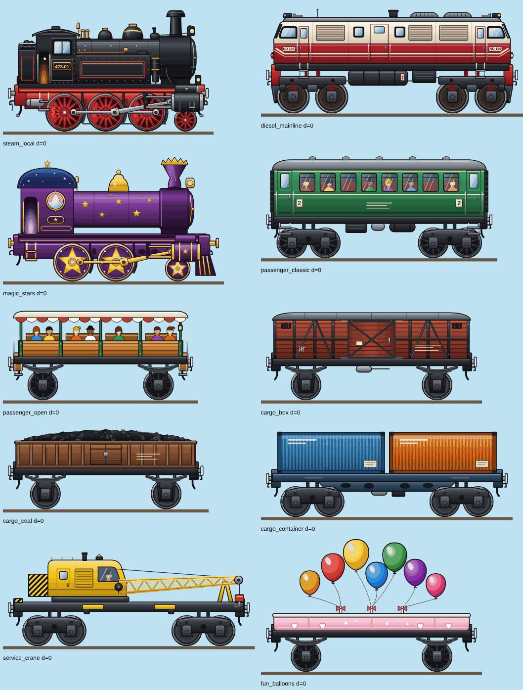
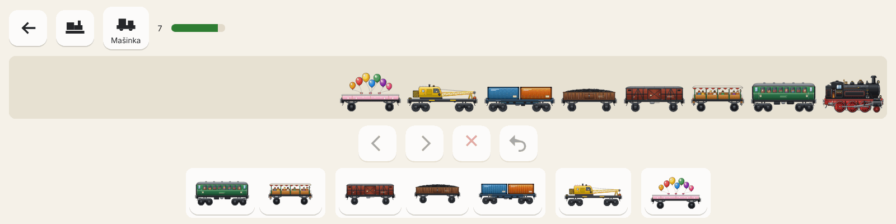
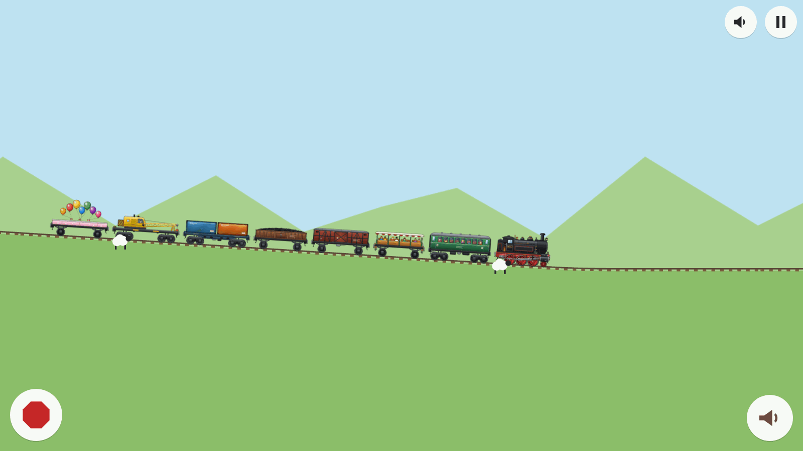

# Ověření iterace „Úpravy první verze“ (dokument 14)

Průběžný protokol iterace podle [zadání 14](../../vlacek-predavaci-balicek/14_UPRAVY_PRVNI_VERZE.md). Lokální běhy v cloudovém kontejneru: headless Chromium 156 (Playwright 1.64), softwarový WebGL bez GPU. Fyzický tablet, telefon a Tesla: **NEOVĚŘENO**.

## Výchozí stav (build `0.1.0+a9991f9`)

Obě chyby ze zadání se v sestavení potvrdily skriptovaným průchodem při DPR 1–3 (1280 × 720, 1180 × 820, 844 × 390):

- Depo kreslilo lokomotivu vlevo a vagonky přidávalo vpravo, tedy před její čelo. Jízda měla pořadí opačné.
- Kamera držela lokomotivu na 30 % šířky v pevném měřítku. Už druhý ze tří vagonků byl po Vyjet mimo obraz.
- Na telefonu na šířku byl katalog depa zalomený a tlačítko Vyjet z větší části pod okrajem.

## A — pořadí soupravy v depu (§1)

| Test                                                      | Red                                   | Green                   |
| --------------------------------------------------------- | ------------------------------------- | ----------------------- |
| E2E „the locomotive leads on the right, new wagons join…“ | FAIL: w3 vpravo od w2 (373 vs. < 252) | PASS (desktop i tablet) |
| E2E „the depot fits a phone held sideways“                | FAIL: Vyjet mimo výřez                | PASS                    |
| tamtéž, poslední karta katalogu dosažitelná               | FAIL: kartu překrývalo tlačítko Vyjet | PASS po opravě mřížky   |

Pás počítá polohy stejnou funkcí `layoutConsist` jako jízda. Ruční snímek telefonu: lokomotiva vpravo čelem doprava, vagonky doleva v pořadí výběru, katalog se posouvá, Vyjet v rohu.

## B — celý vlak v obraze a délkový limit (§2)

Rozhodnutí: [D-008](../decisions/008-whole-train-in-view.md).

| Test                                                                                             | Red                                                                         | Green   |
| ------------------------------------------------------------------------------------------------ | --------------------------------------------------------------------------- | ------- |
| Unit `ConsistEditor` „doc 14 §2: length limit“ (5 testů)                                         | 5 FAIL proti stubům (`0` místo 500, přijetí nad limit…)                     | 17 PASS |
| Unit `cameraFraming` (6 testů)                                                                   | 6 FAIL proti stubům                                                         | 6 PASS  |
| Integrace „a longer train saved by version 0.1“ (2 testy)                                        | 2 FAIL (jízda obnovena, `HOME` místo `RIDING`)                              | 20 PASS |
| Integrace „wagons stop at the length limit with a gentle signal“                                 | bez samostatného red: zapojení pravidel bylo nutné pro překlad; red je unit | PASS    |
| E2E „the depot fills to the length limit…“                                                       | proti buildu `a9991f9`: FAIL `Expected "7", Received "100 / 100"`           | PASS    |
| E2E „Vyjet shows the whole longest train…“, „…over hills and after a resize“, „…after a reload…“ | FAIL proti staré kameře: levý okraj vlaku −281 px                           | 8 PASS  |

Ruční snímky (1280 × 720, 1024 × 768, 844 × 390, nejdelší smíšená souprava s naftovou lokomotivou): celý vlak v obraze na startu i za jízdy, nad brzdou a pod tlačítky v rohu.

`PERF_SECONDS=30 npm run measure:perf` s nejdelší smíšenou soupravou (lokomotiva + 8 vagonků): všech 9 vozidel vykresleno celou dobu, nejvýše 6 živých chunků, žádné chyby. Medián **20 FPS**, p95 50 ms, nejhorší 200 ms. Verze 0.1 měla na stejném stroji 30 FPS. Výřez je teď asi dvakrát širší a v obraze jsou všechny vozy. Příčina se ověří v grafické iteraci; zatím se jen předpokládá vektorové kreslení trati v každém snímku. Jde o emulaci, ne o cílové zařízení.

Známá omezení po B:

- Ve WebGL se části některých vozů ve svahu vykreslovaly chybně; Canvas je kreslil správně. Původní podezření na `Graphics.generateTexture` se nepotvrdilo. Skutečná příčina a oprava jsou v oddílu „WebGL: zkosené vozy“ níže a v [D-010](../decisions/010-webgl-single-texture-batches.md).
- Scéna je při menším vlaku prázdnější a kopce působí velké; řeší grafická iterace a krajina (§3, §5).

## C1 — svižnější jízda (§6)

Rychlost na obrazovce je v novém měřítku `maxSpeedUPerSec × trainWidthFraction / maxConsistLengthU` šířky za sekundu, stejně na každém zařízení. Test `gameConfig` „the ride feels snappy on screen yet easy to follow“: red se 180 u/s (**0,081** šířky/s, pomaleji než 0,14 ve verzi 0.1 na 16:9), green s 480 u/s (0,216 šířky/s), rozjezd 160 u/s² (3 s), dojezd 96 u/s² (5 s), brzda 480 u/s² (1 s). Testy fyziky pohybu nově používají pevné referenční hodnoty místo laditelného výchozího nastavení; 283 unit/integračních PASS, E2E 54 PASS / 4 skipped.

## C2 — výškový profil, generátor v1 (§6)

Rozhodnutí: [D-009](../decisions/009-track-generator-v1.md).

Výchozí měření v0 stejnou metrikou (vzorky po 8 u, 64 chunků): sklon se mění na 94,5 % (svět 1), 93,7 % (77) a 91,4 % (123) délky; výška −42 až 39 u.

| Test                                                                                    | Red                                                                         | Green               |
| --------------------------------------------------------------------------------------- | --------------------------------------------------------------------------- | ------------------- |
| Unit `TrackProfile` v1 (verze, charakter, plány bloků) proti plochému stubu             | 3 FAIL (verze 0, 3 dlouhé roviny místo > 15, prázdný plán)                  | 9 PASS, pak 10 PASS |
| tamtéž GEN-04/05: 1000 světů × 100 chunků (švy výšky a sklonu, konečnost, sklon, výška) | stub vyhověl triviálně; měření v0 výše je skutečný red charakteru           | PASS                |
| „every plan segment is long enough for its transitions“ (300 světů × 20 bloků)          | doplněno při revizi vlastního kódu spolu s opravou validace proveditelnosti | PASS                |
| Integrace „a journey from track generator v0“                                           | FAIL: bez upozornění, jízda obnovena na chunku 7 nové geometrie             | PASS                |
| Validace save s `generatorVersion` 0                                                    | 13 FAIL: fixtury 0.1 hlášené jako poškozené                                 | PASS (55 unit)      |

Ruční snímky jízdy světa 123 s nejdelší soupravou: dlouhé roviny, rovná stoupání a klesání s krátkými oblouky, celý vlak v obraze, žádné chyby konzole.

## WebGL: zkosené vozy (D-010)

Při ručních snímcích nové tratě se ve svahu ve WebGL opakovaně objevovaly klínovité, střižené karoserie. Pokusy na stejné seedované jízdě (snímky každých 2,5 s):

| Pokus                                             | Výsledek        |
| ------------------------------------------------- | --------------- |
| textury vozů z 2D canvasu místo `generateTexture` | chyba trvá      |
| obrázky bez otočeného `Container`                 | chyba trvá      |
| `setTexture` jen při změně                        | chyba trvá      |
| `render.maxTextures: 1`                           | **chyba zmizí** |

E2E `render.spec.ts` (stojící vlak na svahu světa 123, WebGL proti Canvas v rámečku soupravy): bez opatření FAIL, liší se 1,24 % pixelů (dva běhy) a 2,15 % (první běh); s opatřením 0 % ve dvou bězích, PASS na desktopu i tabletu.

Výkon s opatřením (`PERF_SECONDS=30 npm run measure:perf`, nejdelší souprava, generátor v1, 480 u/s): medián 20 FPS, p95 50 ms, nejhorší 83 ms, všech 9 vozidel vykresleno, nejvýše 6 živých chunků. Medián se proti stavu bez opatření nezměnil. Celé E2E: 56 PASS / 4 skipped.

## Depo na užších telefonech (Codex review PR #2, `38310dd`)

Na 667 × 375 a 568 × 320 nestačila šířka pro dva ovládací řádky vedle sebe (~700 px). E2E „the depot fits a phone held sideways“ je nově pro 844 × 390, 667 × 375 a 568 × 320: všechny ovládací prvky celé ve výřezu, bez vzájemného překryvu, poslední karta katalogu klikatelná. Red: 667 × 375 a 568 × 320 FAIL (karta nedosažitelná); po prvním návrhu ještě 568 × 320 FAIL („depart overlaps .strip-item.loco“, pás 56 px byl nižší než 64px dotykový cíl). Green po úpravě (řádky pod sebou, pás nejméně 76 px, menší mezery a Vyjet 64 px): 22 PASS (depo a telefony, desktop i tablet).

## Codex review PR #2 (`3bab3fa`)

- **Nulový podíl šířky vlaku v kameře.** `camera.trainWidthFraction = 0` prošel validací, ale z kamery by udělal nulové přiblížení a nekonečné souřadnice. Validace teď chce kladnou hodnotu. Red: nový unit test 1 FAIL (validace nevrátila nic); green: 5 PASS.
- **Měření nejdelší soupravy hlídalo jen nejlepší vzorek.** Skript `measure:perf` si držel největší počet vykreslených vozidel, takže by prošel, i kdyby se konec vlaku později přestal kreslit. Teď hlídá nejmenší počet ze všech vzorků (`minRenderedVehicles`). Kontrola je přísnější, vadu s chybějícím vozidlem jsem nesimuloval. Green: `PERF_SECONDS=30 npm run measure:perf` PASS, ve všech vzorcích 9 z 9 vozidel (medián 20 FPS, p95 67 ms).
- **Číslo světa u příliš dlouhé jízdy z 0.1** se nemění. Taková jízda nemůže pokračovat a hráč vyjede z depa jako po každé úpravě vlaku, tedy v novém světě (dokument 03 §9, D-007). Generátor v1 navíc krajinu starého čísla stejně mění. Rozhodnutí je na vlastníkovi.

## D0 — grafika vozidel: manifest, atlas, depo (§3)

Rozhodnutí: [D-011](../decisions/011-vector-vehicle-art-and-atlas.md). První vozidlo s finální vektorovou grafikou je malá parní mašinka. Má tři spřažená hnací kola a pojezdové kolo; spojnice, ojnice a křižák se pohybují s koly.

| Test                                                                                  | Red                                                                     | Green             |
| ------------------------------------------------------------------------------------- | ----------------------------------------------------------------------- | ----------------- |
| Unit `steamGear` (klikový čep, spojnice, délka ojnice, zdvih)                         | 4 FAIL proti stubu vracejícímu nulovou polohu                           | 4 PASS            |
| Unit `packAtlas` (bez překryvů, deterministický, odmítne přerostlé díly)              | 2 FAIL proti stubu s prázdným atlasem (deterministika prošla triviálně) | 3 PASS            |
| Unit manifest: `steam_local` má grafiku, žádné nepoužité soubory                      | 2 FAIL (bez grafiky, 7 nepoužitých SVG)                                 | PASS              |
| Unit `vehicleArtLayers` (pořadí, kola na kolejnici, otáčení, táhla)                   | 4 FAIL proti stubu vracejícímu `[]`                                     | 5 PASS            |
| Unit `validateVehicleArt` (jeden vzhled, soubory a viewBox, délka, kola, táhla)       | 5 FAIL proti stubu bez chyb                                             | 7 PASS            |
| Tooling `validate:assets` (výpis s grafikou, `--release`)                             | 1 FAIL (starý výpis bez grafiky)                                        | 2 PASS            |
| Unit atlas: všechny díly se vejdou do 2048² při největším měřítku                     | 1 FAIL (stub bez položek)                                               | PASS              |
| Unit `artScaleFor` (krok 0,25 nad zoomem, meze 0,5–2,5)                               | 1 FAIL (stub vracel 2,5)                                                | PASS              |
| E2E `art.spec.ts`: jízda kreslí mašinku z atlasu; depo ukazuje 9 dílů ze stejných SVG | 2 FAIL proti buildu `3bab3fa` (`artVehicles` chybí, 0 dílů)             | PASS              |
| E2E tamtéž PWA-10: zablokovaný soubor karoserie → placeholder, jízda pokračuje        | FAIL bez zachycení chyby atlasu (UI zamrzlo, klik 30 s timeout)         | PASS              |
| E2E tamtéž D-011: 1280 × 720 → 0,75 px/u, po zvětšení okna na 1920 × 1080 → 1 px/u    | FAIL proti buildu s pevnými 2 px/u (`pxPerU` chybí)                     | PASS              |
| E2E `render.spec.ts` (WebGL proti Canvas, stojící vlak na svahu) s novou grafikou     | —                                                                       | PASS, 0 % rozdílů |

Při prvním spuštění E2E se scéna vůbec nenačetla: Phaser 4.2.1 dekóduje každé `data:` URI jako base64, ale Vite vložil malé SVG URL-kódované (`atob` výjimka v konzoli, UI zamrzlé). Soubory vozidel proto zůstávají v buildu samostatně (`assetsInlineLimit`).

Ruční snímky skutečné aplikace (1280 × 720): výběr mašinky, depo a jízda. Atlas 0,75 px/u: mašinka je vyhlazená, s viditelnými táhly a koly. První verze s pevnými 2 px/u byla zubatá (zmenšení 3,5×), proto se měřítko řídí zoomem.

## D1 — detailní grafika všech deseti vozidel (§3)

Všech 10 vozidel současného katalogu má vlastní vektorovou kresbu:

- **Lokomotivy:**
  - malá parní: tři spřažená kola, pojezdové kolo, spojnice, ojnice, křižák, plamen v kabině;
  - velká naftová: dvě kabiny, žaluzie, palivová nádrž, dvounápravové podvozky;
  - hvězdičková: hvězdná kola se zlatými táhly, tulipánový komín, kabina s kulatým oknem.
- **Vozy:**
  - osobní vůz s cestujícími v oknech;
  - výletní vagónek s lavicemi a stříškou;
  - krytý vůz s posuvnými dveřmi;
  - uhlák s nákladem uhlí;
  - kontejnerový vůz se dvěma kontejnery;
  - jeřábový vůz s obsluhou a ležícím výložníkem;
  - balónkový vagónek.

Všechny nárazníky jsou 30 u nad kolejnicí, takže na sebe vozy v soupravě navazují. Lesk a stín kol nese neotáčivý překryv. Nikde nejsou loga dopravců ani obličeje lokomotiv. Barevné placeholder vzhledy zmizely; z placeholderu zbyla jedna neutrální silueta se žlutými šrafami pro selhání načtení grafiky (PWA-10).

| Test                                                                                       | Red                                                             | Green                     |
| ------------------------------------------------------------------------------------------ | --------------------------------------------------------------- | ------------------------- |
| Unit `validateVehicleArt`: vlastní kresba každého typu, každý díl použit; `releaseErrors`  | 2 FAIL (pravidlo chybělo, stub `releaseErrors`)                 | PASS                      |
| Tooling `validate:assets` a `--release` se skutečným katalogem                             | starý test čekal 9 placeholderů a selhání release               | 2 PASS (0 placeholderů)   |
| E2E `art.spec.ts`: všechna vozidla z atlasu (33 rámečků), depo, PWA-10, překreslení        | —                                                               | 8 PASS (desktop i tablet) |
| E2E `render.spec.ts` „D-010: interleaved textures“ (grafika zablokovaná, fallback siluety) | s výchozím `maxTextures` FAIL, lišilo se 0,98 % a 0,97 % pixelů | PASS s `maxTextures: 1`   |

[D-010](../decisions/010-webgl-single-texture-batches.md) proto zůstává. Původní test s grafikou v jednom atlasu prošel i bez opatření (3 běhy). Chybu ale vyvolá každé střídání textur a krajina a částice je přinesou.

Výkon (`PERF_SECONDS=30 npm run measure:perf`, nejdelší souprava, software WebGL kontejneru):

- medián 20 FPS, stejně jako před grafikou;
- p95 66,6 ms (dříve 50 ms), nejhorší snímek 83 ms;
- všech 9 vozidel vykresleno.

Fyzická zařízení: **NEOVĚŘENO**.

Kontaktní list (stejné SVG díly a stejné skládání `vehicleArtLayers` jako ve hře):

Skutečná aplikace, 1600 × 900, svět 7: depo se všemi sedmi vozy a stojící souprava po jízdě. Ovečky jsou zatím placeholder scénky (E2).

## E1 — kolej a terén (§3, §6)

Rozhodnutí: [D-012](../decisions/012-track-tiles-and-terrain.md). Kolej z vektorových dlaždic: kolejnice s lesklou hlavou, upevnění, konce pražců, štěrk, travnatý okraj. Pod ní seedovaný násep a louka v pásech.

| Test                                                                                    | Red                                                      | Green               |
| --------------------------------------------------------------------------------------- | -------------------------------------------------------- | ------------------- |
| Unit `embankmentU` (determinismus, meze a pestrost, spojitost přes chunky a uzly)       | 2 FAIL proti stubu vracejícímu 0                         | 3 PASS              |
| Unit `trackTilePlacements` (po 64 u na kolejnici, tětiva k další dlaždici, varianty)    | 2 FAIL proti stubu `[]`                                  | 3 PASS              |
| Unit manifest světa a `validateWorldArt` (chybějící, špatná velikost, zbylé, nepoužité) | 2 FAIL (bez dlaždic, stub validátoru)                    | 4 PASS              |
| Tooling `validate:assets` (výpis s díly světa)                                          | 1 FAIL (výpis bez světa)                                 | 2 PASS              |
| Unit konfigurace `world.terrain`                                                        | přidáno spolu s konfigurací (bez samostatného red)       | PASS                |
| E2E švy na Canvasu, nově bez pevné barvy země                                           | s nulovým přesahem chunků FAIL (šev na x 98, 688 a 1278) | PASS s přesahem 4 u |
| E2E `game`, `render`, `art`                                                             | —                                                        | 64 PASS / 4 skipped |

Výkon (`PERF_SECONDS=30 npm run measure:perf`, nejdelší souprava):

| Varianta                       | Medián FPS | p95     |
| ------------------------------ | ---------- | ------- |
| Dlaždice a 7 pásů louky po 8 u | 15         | 83 ms   |
| Jen 1 pás louky                | 20         | 50 ms   |
| Bez dlaždic (dražší jsou pásy) | 15         | 83 ms   |
| Obrysy země po 32 u (výsledek) | 20         | 66,6 ms |

Nejhorší snímek výsledné varianty měl 83 ms.

## E2 — krajina z lokalit, pozadí a zvířata (§3, §5)

Rozhodnutí: [D-013](../decisions/013-landscape-localities-and-backdrops.md). Biomy podle gramatiky dokumentu 04 a logické lokality se stabilními ID. Voda tvoří rovné nádrže se zaoblenými konci. Krajinu tvoří 114 vektorových dílů a dva atlasy, pozadí jsou ve dvou rychlostech parallaxy a mraky. Zvířata jsou velká, vždy pod vlakem a nad tlačítky. Země se jednou předkreslí do textury a hra se kreslí bez MSAA.

| Test                                                                                    | Red                                                                                                                                | Green                                      |
| --------------------------------------------------------------------------------------- | ---------------------------------------------------------------------------------------------------------------------------------- | ------------------------------------------ |
| Unit `biomeAt` a `chunkScenery` (gramatika, sloty, nádraží na rovině, ID, druhy zvířat) | `Biomes` 3 FAIL a `Scenery` 4 FAIL proti stubům; pak opravy rozpočtu přechodu, hostitele zvířete a doplňků nádraží                 | 40 PASS (`tests/unit/world`)               |
| Unit blízké rekvizity nepřesáhnou do vlaku i s perspektivním zvětšením                  | 1 FAIL (chybějící `nearDepthScale`)                                                                                                | 6 PASS                                     |
| Unit voda: lodě i se svou trasou na hladině, stavby a stromy na suchu                   | 3 FAIL (bez nádrží); po první implementaci 2 FAIL (plachetnice v polovině přechodu, lípa nádraží ve vodě pláže)                    | 10 PASS                                    |
| Unit bohatší louka, velká zvířata pod vlakem, kachna na rybníčku                        | 6 FAIL (13 nepoužitých dílů, chybí `ANIMAL_SCALE`, průměr blízkých rekvizit ≤ 20, kachna 7 u před rybníčkem); pak 1 FAIL (kapradí) | 238 PASS (celé unit)                       |
| Unit použití všech dílů světa a atlas pozadí                                            | 2 FAIL (stub `worldUsedKeys`: 97 nepoužitých dílů); 2 FAIL (chybějící strop atlasu pozadí, hlavní atlas se nevešel při 2,5 px/u)   | PASS (strop 2 px/u, pozadí 1 px/u)         |
| Unit okraje snímků atlasu a počátek pivotu (`framesWithMargin`, `frameOrigin`)          | 2 FAIL (chybějící funkce)                                                                                                          | 8 PASS                                     |
| Unit `placeAnimal` (pás nad tlačítky, zmenšení na telefonu, nikdy do vlaku)             | 3 FAIL proti stubu                                                                                                                 | 5 PASS                                     |
| E2E krajina ze dvou atlasů (počty snímků z manifestů, biom, lokality, bez chyb)         | FAIL: UI zamrzlo, Vite vložil 59 SVG světa jako data URI                                                                           | PASS po vyloučení `assets/world/` z inline |
| E2E blízké rekvizity ani zvířata nepřekryjí nejdelší vlak (seedy 7, 123, 2026)          | mutace `NEAR_FOOT_OFFSET_U = -60`: FAIL (2 překryvy)                                                                               | PASS                                       |
| E2E telefon 844 × 390: zvířata nad brzdou a houkačkou                                   | FAIL 242,7 px proti hraně 242 px (pruh kamery bez zvětšené dotykové plochy brzdy); mutace bez omezení: FAIL 276,6 px               | PASS                                       |
| E2E švy na Canvasu jen na hranicích chunků (`chunkEdges`)                               | FAIL na stoncích rostlin; mutace bez přesahu chunků: FAIL na x 99, 689, 1278                                                       | PASS                                       |
| E2E čára přes oblohu (jednopixelový řádek přes půl šířky, se sondou vložené čáry)       | FAIL starého testu: předpokládal jednobarevnou oblohu                                                                              | PASS, sonda čáru najde                     |
| E2E D-010 náhradní siluety WebGL proti Canvasu bez MSAA                                 | FAIL 0,45 % pixelů (siluety bez průhledného okraje)                                                                                | PASS s okrajem 2 px                        |
| `npm run check`, celé `npm run test:e2e`                                                | —                                                                                                                                  | 344 unit PASS; E2E 80 PASS / 4 skipped     |

Výkon (`PERF_SECONDS=30 npm run measure:perf`, nejdelší souprava, Chromium headless se softwarovým WebGL, 1280 × 720):

| Varianta                                                      | Medián FPS | p95    |
| ------------------------------------------------------------- | ---------- | ------ |
| E1 (před krajinou)                                            | 20         | 50 ms  |
| První zapojení krajiny                                        | 12         | 100 ms |
| Obloha jen nad pozadím, výplň jen do propadů, oříznutá pozadí | 15         | 83 ms  |
| Zem chunku předkreslená do textury                            | 15         | 67 ms  |
| Bez MSAA, okraje snímků atlasu (výsledek)                     | **30**     | 50 ms  |

Test D-010 se záložními siluetami jednou selhal při zátěži celé sady. Měření s nulovou mezí ukázalo příčinu:

- s grafikou se WebGL a Canvas shodují přesně (0 %);
- záložní varianta měla 0,13–0,19 % rozdílných pixelů při mezi 0,2 %.

Rozdíl dělala záložní kolej kreslená v každém snímku čarou `Graphics`: bez MSAA je ve WebGL zubatá, na Canvasu hladká. Po předkreslení do textury, stejně jako zem, je rozdíl 0–0,004 %. Mez testu se neměnila.

Nejhorší snímek výsledné varianty měl 83 ms. Krátký pokus se skrýváním vrstev (dočasný parametr, odstraněn) ukázal, že nejvíc stálo kreslení `Graphics` v každém snímku: louka ubírala 4 FPS a zem za tratí 3 FPS. Měřeno v emulaci tohoto kontejneru, ne na cílovém zařízení.

Snímky ze skutečné aplikace (dokument 14 §7, `?debug=1`, diagnostika skrytá), všechny bez chyb a bez překryvu vlaku:

- [venkov: pastvina, vesnice se silnicí a autem, pole](img/2026-10-10-krajina-venkov.jpg);
- [les a paseka](img/2026-10-10-krajina-les.jpg);
- [rybníky: jezero s rovnou hladinou, rybníček, kachna](img/2026-10-10-krajina-rybniky.jpg);
- [nádraží v podhůří](img/2026-10-10-krajina-nadrazi.jpg);
- [zasněžené hory](img/2026-10-10-krajina-hory.jpg);
- [pobřeží: zátoky, maják, lodě, pláž](img/2026-10-10-krajina-pristav.jpg);
- [telefon naležato 844 × 390, kráva nad brzdou](img/2026-10-10-krajina-podhuri-telefon.jpg).

Fyzický tablet, telefon a Tesla: **NEOVĚŘENO**.

## F — částice a drobné animace (§4)

Rozhodnutí: [D-014](../decisions/014-particles-and-small-animations.md). Vlak a krajina mají tyto pohyby:

- **Kouř a pára.** Kouř jde v taktech hnacích kol, při rozjezdu přibývá bílá pára. Diesel má lehký výfuk, hvězdičková mašinka pouští hvězdičky.
- **Jiskry, sníh a listí.** Jiskry létají jen při prudkém brzdění. Sníh a listí víří kola jen tam, kde leží, a jen za jízdy.
- **Krajina.** Tráva a stromy se houpou, voda občas zableskne, zvířata jemně dýchají. Občas přeletí ptáci nebo motýli.

Vše běží v simulačním čase s omezeným polem částic a úsporným profilem podle dokumentu 13.

| Test                                                                                                       | Red                                                                                                        | Green                                  |
| ---------------------------------------------------------------------------------------------------------- | ---------------------------------------------------------------------------------------------------------- | -------------------------------------- |
| Unit `ParticleField` (kapacita, životnost, pohyb ve světě, pauza, determinismus, prolínání, úsporný strop) | 5 FAIL proti stubu (2 triviálně PASS)                                                                      | 7 PASS                                 |
| Unit emise (hodiny emisí, emitter se sklonem, sníh a listí podle podkladu), `TrainEffects`, `AmbientLife`  | 15 FAIL proti stubům; po implementaci 1 FAIL (ve stání příliš mnoho páry proti jízdě) → klidnější obláček  | 27 PASS                                |
| Unit emitery v manifestu (každý efekt lokomotivy na modelu, uvnitř rámu, vagony bez emitorů)               | 1 FAIL (`steam_local` bez emitoru)                                                                         | PASS                                   |
| Unit `RideSimulation.lastIntent`                                                                           | 1 FAIL (`undefined`)                                                                                       | 12 PASS                                |
| Unit profily kvality dokumentu 13 a jejich validace                                                        | 2 FAIL                                                                                                     | 7 PASS                                 |
| Unit houpání a odlesky (`ambientMotion`)                                                                   | 3 FAIL proti stubu                                                                                         | 3 PASS                                 |
| E2E kouř při jízdě v rozpočtu, zastavení v pauze, čistý diesel, strop 96 při omezených efektech            | 4 FAIL proti buildu E2 (`0b85346`, chybí diagnostika efektů); mutace „částice po reálném čase“: FAIL pauzy | 8 PASS                                 |
| `npm run check`, celé `npm run test:e2e`                                                                   | —                                                                                                          | 379 unit PASS; E2E 88 PASS / 4 skipped |

Výkon (`PERF_SECONDS=30 npm run measure:perf`, nejdelší souprava): medián 30 FPS, p95 50 ms, nejhorší snímek 100 ms. Proti E2 beze změny mediánu.

Snímky ze skutečné aplikace:

- [kouř za jedoucím vlakem v lese, rozvířené listí](img/2026-10-10-efekty-les.jpg);
- [brzdění na sněhu: kouř, sníh u kol, jiskry](img/2026-10-10-efekty-snih.jpg).

Fyzický tablet, telefon a Tesla: **NEOVĚŘENO**.

## G1 — přejezdy (§5)

Rozhodnutí: [D-015](../decisions/015-level-crossings.md). Ve slotu 3 bloku stojí na rovné koleji přejezd se silnicí do hloubky obrazu, závorami, světly a provozem aut a cyklistů. Automat drží závory dole, dokud na silnici je kterákoli část soupravy nebo se vlak blíží na Dclose. Auta čekají za stop čárou a po zvednutí závor projedou.

| Test                                                                                                                                       | Red                                                                                                                                   | Green                                  |
| ------------------------------------------------------------------------------------------------------------------------------------------ | ------------------------------------------------------------------------------------------------------------------------------------- | -------------------------------------- |
| Unit konfigurace přejezdů a Dclose z nejvyšší rychlosti                                                                                    | 1 FAIL (chybí `crossing`)                                                                                                             | 8 PASS                                 |
| Unit umístění (slot 3, rovná kolej, odstup od zvířete) a rezervace pruhu silnice ve scenérii                                               | 2 FAIL proti stubu; pak scenérie bez `crossing`                                                                                       | 81 PASS (svět, obsah)                  |
| Unit automat `LevelCrossing` (SCN-04, 05, 06, 07, 08, 12 a fuzz invariantu)                                                                | 6 FAIL proti stubu (2 triviálně PASS); první implementace 2 FAIL na chybném nastavení testů (Dclose od okraje rozšířené zóny, SCN-07) | 8 PASS                                 |
| Mutace: zavírání ignoruje blížící se vlak                                                                                                  | SCN-04 a fuzz FAIL                                                                                                                    | obnoveno                               |
| Unit přejezdy v `RideSimulation` (SCN-13 nejdelší souprava, SCN-08 obnova)                                                                 | 2 FAIL (žádné přejezdy)                                                                                                               | 14 PASS                                |
| Unit uspořádání silnice: fronta před tratí u paty náspu, nejhorší doba vyklizení ≤ `roadClearanceSeconds`, šířka silnice = konfliktní zóna | 3 FAIL (fronta na 40 místo 56 u, stub `Infinity`, šířka 22 proti 24 u)                                                                | 31 PASS                                |
| Mutace: kola 46 u/s                                                                                                                        | FAIL (vyklizení 2,43 s > 2 s)                                                                                                         | obnoveno                               |
| Unit body světel a kloubu na výstražnících                                                                                                 | 1 FAIL proti stubu                                                                                                                    | 9 PASS                                 |
| Unit kresba přejezdu (`crossingLayout`): závory mezi stop čárou a kolejí, nízký výstražník a zvednuté břevno pod vlakem, pruhy, světla     | 6 FAIL proti stubům (4 PASS původní silnice)                                                                                          | 10 PASS                                |
| E2E závory dole před příjezdem i pod vlakem, nahoru až za posledním vagonem; fronta čeká u stojícího vlaku a po odjezdu projede            | 2 FAIL (diagnostika bez `crossings`)                                                                                                  | 2 PASS                                 |
| `npm run check`, celé `npm run test:e2e`                                                                                                   | —                                                                                                                                     | 406 unit PASS; E2E 92 PASS / 4 skipped |

Výkon (`PERF_SECONDS=30 npm run measure:perf`, nejdelší souprava): medián 30 FPS, p95 50 ms, nejhorší snímek 167 ms (jednorázová špička). Medián i p95 jsou proti F beze změny.

Snímky ze skutečné aplikace:

- [vlak zastavil před zavřeným přejezdem, za závorou čeká auto](img/2026-10-10-prejezd-pred-vlakem.jpg);
- [vlak stojí přes přejezd, zespodu přijíždí auto k frontě](img/2026-10-10-prejezd-pod-vlakem.jpg);
- [detail: vysoký výstražník za tratí, nízký před ní, svítí červená, břevna dole](img/2026-10-10-prejezd-detail.jpg).

Fyzický tablet, telefon a Tesla: **NEOVĚŘENO**.
